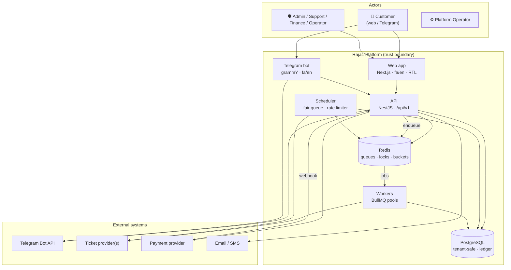
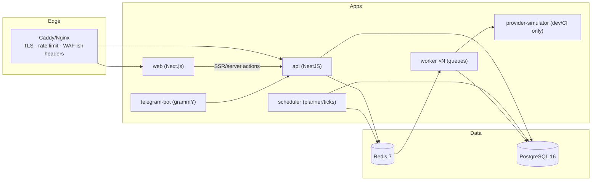
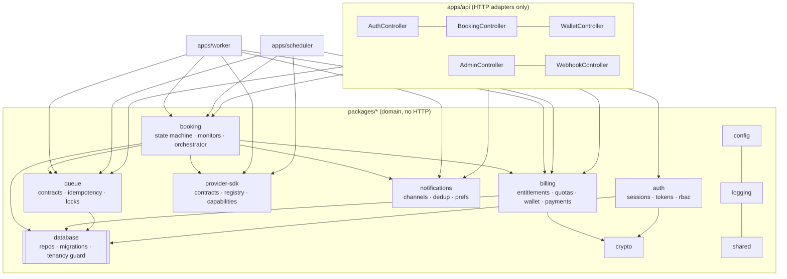
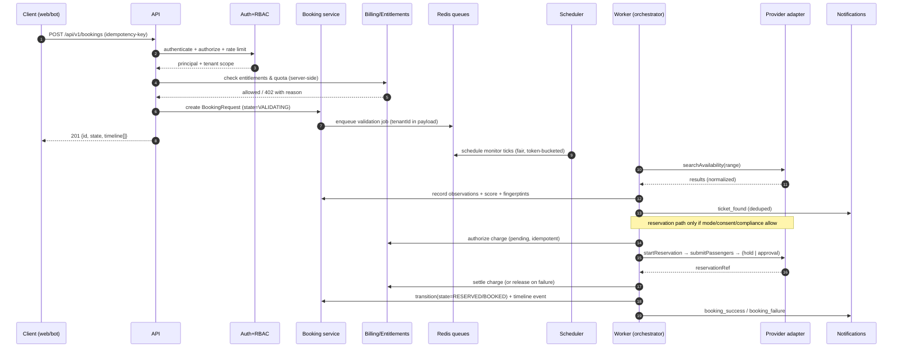
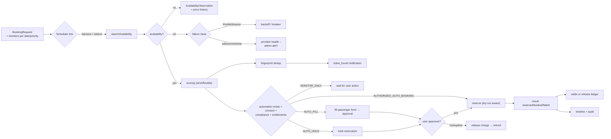
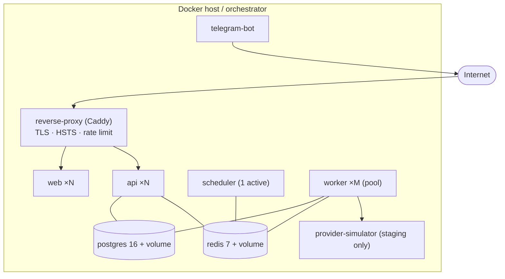

# Architecture

> Status: authoritative for the implementation in this repository.
> Related: [domain-model.md](domain-model.md) · [threat-model.md](threat-model.md) ·
> [booking-state-machine.md](booking-state-machine.md) · [scheduler.md](scheduler.md) ·
> [ADRs](adr/)

---

## 1. System context



**Trust boundaries.** (1) Browser/Telegram client → API. (2) API/worker → provider (outbound,
untrusted responses). (3) Payment provider → webhook (untrusted input, signature-verified).
(4) Operator → admin surface (audited). (5) Data plane → observability exporters (redacted).

---

## 2. Containers and why they are separate



| Container | Responsibilities | Scaling unit | Why separate |
| --- | --- | --- | --- |
| `api` | AuthN/Z, CRUD, booking requests, wallet/billing command API, admin API, webhooks, metrics | Stateless, N replicas | Request/response latency must not be coupled to long-running browser jobs |
| `worker` | Availability searches, reservation orchestration, provider sync, notification delivery, billing settlement, session refresh, maintenance | N replicas × pool size | Long-running, memory-heavy (browser contexts), bursty |
| `scheduler` | Fair tick selection, rate-limit tokens, release-window planning, warm-up dispatch, capacity admission, breaker probes | **Singleton with lease** | Global ordering/limits must have a single authority; a Redis lease makes it HA |
| `telegram-bot` | Update polling/webhook, conversation state, inline keyboards | 1 replica (or webhook+2) | Different lifecycle and update semantics |
| `web` | SSR UI, i18n, RTL | N replicas | Independent deploy cadence |
| `provider-simulator` | Deterministic fake provider (availability, CAPTCHA states, failures) | dev/CI only | Enables E2E + chaos tests without touching real providers |

**Why not microservices.** The domain has *tight transactional coupling* around booking↔billing↔
inventory (a booking charge must settle with the reservation outcome in one logical unit) and the
team is small. We adopt a **modular monolith + independently scalable workers** and enforce module
boundaries in-process (dependency-cruiser-style rules + package boundaries). Splitting services is
a reversible decision; premature distribution is not. See [ADR-0001](adr/0001-modular-monolith.md).

---

## 3. Module map (in-process boundaries)



**Dependency rule.** `shared` < `config`/`logging`/`crypto` < `database` < `queue`/`provider-sdk`
< `billing`/`notifications`/`auth` < `booking` < `apps/*`. No package imports an app. The provider
*auth/session* concerns live behind `provider-sdk`; core code never imports a provider's selectors
or route names.

---

## 4. Core services and their boundaries

| Service | Owns | Must never |
| --- | --- | --- |
| Authentication | credentials, sessions, refresh-token family, TOTP-ready hooks | see passenger PII |
| User | profile, settings, roles, Telegram link | mutate wallet balance directly |
| Passenger | encrypted PII, per-user scoping, export/deletion | log decrypted values |
| Subscription | plan, entitlements, period, quota counters | compute prices inline |
| Billing/Wallet | append-only ledger, charges, refunds, invoices, coupons, referrals | update a balance without a ledger row |
| Booking | requests, monitors, state machine, attempts, timeline | talk to a provider directly (only via orchestrator) |
| Orchestrator | reservation workflow, locks, idempotency, approval gates | bypass entitlements or rate limits |
| Availability search | search jobs, fingerprints, price observations | notify users (that is the notification service) |
| Provider adapter | provider protocol, sessions, parsing, capability flags | leak provider specifics upward |
| Proxy/Account manager | pools, health/quarantine, rotation **within** legitimate limits | rotate to evade restrictions |
| Scheduler | fairness, tokens, release planning, admission control | exceed global provider limits |
| Notification | channel dispatch, dedup, preferences, templates | contain business rules |
| Admin | operator actions, masked views, kill switch | bypass audit |
| Audit | immutable event log, correlation | store secrets |
| Analytics | aggregates of ≥ k users, funnel metrics | expose per-user booking detail |

---

## 5. Multi-tenancy model

**Model: shared schema, mandatory tenant scoping, defense in depth.**

```
Tenant 1 ─┬─ Users ─┬─ Passengers
          │         ├─ Wallet ── WalletTransaction (append-only)
          │         ├─ Subscriptions ── Quotas
          │         ├─ BookingRequests ── Monitors ── Attempts ── Results ── Timeline
          │         └─ Notifications, SupportTickets, AuditEvents
          ├─ ProviderAccounts (tenant-owned credentials) ── ProviderSessions
          └─ Settings/FeatureFlag overrides
Platform ─┴─ Plans, Coupons(global), Providers, Proxies, SystemSettings, Flags(global)
```

| Layer | Isolation mechanism |
| --- | --- |
| Database | `tenant_id` on every tenant-owned table (NOT NULL, FK), composite indexes prefixed by `tenant_id`, **mandatory** `TenantScope` in every repository call; no repository exposes an unscoped `findById` |
| Query building | Repositories accept a `scope` object; queries are built from it — a missing scope is a type error, not a runtime check |
| Cache | keys are `t:{tenantId}:...`; cache values never cross tenants; no global entity cache for tenant data |
| Queue | every job payload carries `tenantId`; workers re-establish scope from the payload and verify the entity's tenant matches before acting |
| Notifications | delivery resolves the recipient from the scoped entity; templates never interpolate another tenant's data |
| Logs | structured logger binds `tenantId`; PII redaction at the serializer level |
| Realtime/webhooks | outbound webhooks (future) signed per-tenant with per-tenant secrets |
| Analytics | aggregates requester's `minCohort` (default 5) to prevent inference |
| Platform staff | admin queries require explicit permission + justification, and produce audit events; PII is masked unless the actor holds `pii:read` |

Cross-tenant leakage is treated as a **severity-1** class of defect with dedicated test suites
(`packages/testing` tenant-isolation matrix) and a CI gate. See [domain-model.md](domain-model.md) § 5.

---

## 6. Request lifecycle (web/Telegram → provider)



---

## 7. Booking and monitoring data flow



---

## 8. Concurrency, idempotency, and consistency

| Concern | Mechanism |
| --- | --- |
| Duplicate booking | Redis lock `booking-lock:{requestId}` (TTL + fencing token) **and** DB `SELECT … FOR UPDATE` on the booking row **and** unique partial index on `(booking_request_id)` where state in terminal-success states **and** provider reservation reference uniqueness |
| Duplicate charge | Ledger idempotency key derived from `(bookingRequestId, purpose, attemptSeq)`; unique index; replays return the original transaction |
| Payment webhook replay | Signature verification + unique `(provider, externalEventId)` + state check on the invoice/payment |
| Queue redelivery | Jobs are idempotent by `jobId`/idempotency key; handlers re-read state and no-op if already applied |
| Worker crash mid-booking | Attempt rows carry `leaseOwner`+`leaseExpiresAt`; recovery job re-evaluates provider state (`getReservationStatus`) **before** any retry — never blind re-submit |
| Wallet races | All balance changes via ledger insert inside a DB transaction with `SELECT … FOR UPDATE` on the wallet row; derived balance cached but authoritative value is the sum |
| Coupon race | Redemption insert with unique `(couponId, userId)`/counter update under row lock; violates limit → rejected transactionally |
| Scheduler duplication | Singleton lease in Redis with fencing; stale lease holder's ticks rejected by DB check on the lease token |
| Time | All timestamps stored UTC (`timestamptz`); provider-local timezone applied only at the adapter boundary; user-facing display converted in the client layer |

---

## 9. Observability

| Signal | Implementation |
| --- | --- |
| Logs | `pino` JSON, one line per event, `correlationId`/`tenantId`/`jobId`/`bookingId` bound, PII redaction (see `packages/logging`) |
| Metrics | `prom-client`: HTTP latency/errors, queue depth/age, job outcomes by queue, provider latency/errors, rate-limit denials by bucket, breaker state, ledger operations, booking funnel, entitlement denials, worker pool saturation |
| Health | `/health/live` (process), `/health/ready` (DB, Redis, migrations applied, config valid), `/health/provider` (breaker per provider) |
| Traces | Playwright traces on failure (sanitized, short retention, access-controlled) |
| Audit | Immutable `audit_events` with actor, action, target, before/after hash, correlation |

---

## 10. Failure and degradation strategy

| Failure | Behaviour |
| --- | --- |
| Provider DOWN (breaker open) | Stop searches for that provider, serve cached availability metadata, notify affected users with honest status, alert admins, queue jobs (not drop) |
| Redis down | API degrades to synchronous where safe; booking submission is **blocked** (no locks ⇒ no submissions), monitoring pauses, alert critical |
| DB down | API returns 503 with `Retry-After`; workers pause consuming; no financial operation is attempted |
| Worker crash | Lease expiry → recovery job verifies provider state before any retry |
| Provider UI change | Adapter detects selector/schema mismatch → marks booking path unsafe for that provider, notifies admins, captures sanitized diagnostics, stops retrying |
| Payment provider down | Invoice stays PENDING, wallet not credited, user notified; retries with backoff and jitter |
| Scheduler lease lost | New holder takes over; stale holder's writes rejected by fencing token |
| Maintenance mode | Three levels (full / provider / monitoring-only) with safe transitions for in-flight jobs |
| Kill switch | Immediate: no new submissions; existing monitors continue; users notified with reason |

---

## 11. Deployment topology



Details, volumes, backups and restore drill: [deployment.md](deployment.md).

---

## 12. Architecture decision records

| ADR | Decision |
| --- | --- |
| [0001](adr/0001-modular-monolith.md) | Modular monolith + independently scalable workers (not microservices) |
| [0002](adr/0002-provider-adapter-boundary.md) | Provider-specific code isolated behind `provider-sdk`; no selectors in core |
| [0003](adr/0003-pglite-for-db-tests.md) | Tests run against real Postgres semantics via PGlite (WASM) when no server is available |
| [0004](adr/0004-append-only-ledger.md) | Money is an append-only ledger; balances derived, never assigned |
| [0005](adr/0005-dry-run-first.md) | Fail-closed `DRY_RUN` default with three independent submission guards |
| [0006](adr/0006-integer-minor-units.md) | Money as integer minor units + currency code, never floats |
| [0007](adr/0007-scheduler-authority.md) | Single scheduler authority via Redis lease + fencing tokens |
| [0008](adr/0008-no-captcha-bypass-no-evasion.md) | No CAPTCHA solving, no fingerprint spoofing, no account/proxy rotation to evade controls |
