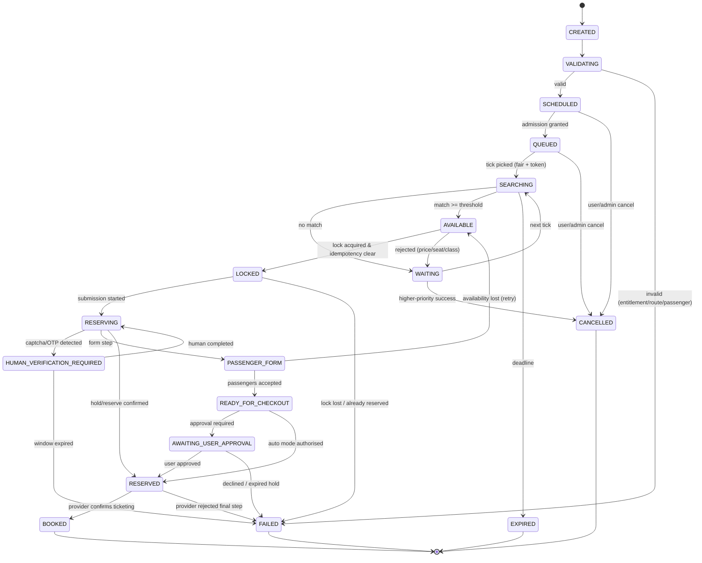

# Booking State Machine

> Implemented in [`packages/booking/src/state-machine.ts`](../packages/booking/src/state-machine.ts).
> Every transition is validated centrally; arbitrary status updates are impossible from code
> because the booking row's `status` column is only writable through the state machine.

---

## 1. States

| State | Meaning | Terminal |
| --- | --- | --- |
| `CREATED` | Request persisted, not yet validated | no |
| `VALIDATING` | Server-side validation: route, dates, passengers, entitlements, budget, provider capability | no |
| `SCHEDULED` | Monitors created; waiting for release time / start time | no |
| `QUEUED` | Admitted into scheduler queues (priority assigned) | no |
| `SEARCHING` | Availability searches running | no |
| `WAITING` | No match in the current tick; waiting for the next scheduled search | no |
| `AVAILABLE` | A match was found and scored above the acceptance threshold | no |
| `LOCKED` | Distributed lock + DB row lock acquired; duplicate submissions prevented | no |
| `RESERVING` | Provider reservation started (hold or full reservation) | no |
| `HUMAN_VERIFICATION_REQUIRED` | Provider presented CAPTCHA / OTP / human step; job paused, context preserved | no |
| `PASSENGER_FORM` | Passenger data being submitted/validated on the provider side | no |
| `READY_FOR_CHECKOUT` | Provider accepted passenger data; payment step reached | no |
| `AWAITING_USER_APPROVAL` | Waiting for explicit user confirmation before the irreversible action | no |
| `RESERVED` | Provider holds/confirms the reservation (not yet paid/ticketed) | no |
| `BOOKED` | Fully completed with the provider | **yes (success)** |
| `FAILED` | Unrecoverable failure for this attempt/request | **yes** |
| `EXPIRED` | Monitor/request deadline passed without success | **yes** |
| `CANCELLED` | Cancelled by user or admin, or auto-cancelled after a higher-priority success | **yes** |



---

## 2. Transition table (authoritative)

Guards are evaluated in order; the first failing guard rejects the transition with a typed error.

| From → To | Trigger | Guards | Side effects (same DB transaction) |
| --- | --- | --- | --- |
| `CREATED → VALIDATING` | `submit` | idempotency key unused or replayable; tenant active; user not suspended | timeline `request_created`; audit |
| `VALIDATING → SCHEDULED` | `validated` | route exists for provider; dates in provider sale window; passengers belong to tenant, complete, not expired; entitlement `maxActiveMonitors` available; quota `bookingRequests` available; price ceiling set; automation mode allowed by provider capabilities + flag | create `booking_monitors` (one per leg/date, priority from request); quota increment; timeline |
| `VALIDATING → FAILED` | `validationFailed` | — | quota release; notification `booking_failure`; audit |
| `SCHEDULED → QUEUED` | `admitted` | release window admission (if high-demand) granted, or normal admission | compute `next_search_at` per strategy; timeline |
| `QUEUED → SEARCHING` | `tick` | rate-limit token acquired; breaker closed for provider; maintenance allows monitoring | create `search_jobs` row; attempt row; timeline `monitoring_activated` |
| `SEARCHING → WAITING` | `noMatch` | — | record observation; compute backoff; timeline (throttled/deduped) |
| `SEARCHING → AVAILABLE` | `match` | score ≥ threshold; price ≤ `max_price_minor`; availability ≥ `min_availability`; class/seat/train constraints satisfied under matching mode | persist `booking_results`; notify `ticket_found` (deduped); timeline |
| `AVAILABLE → LOCKED` | `lock` | Redis lock acquired (`booking-lock:{requestId}`); DB row lock acquired; **no** existing live reservation; **no** successful terminal state; idempotency key for the action fresh | store fencing token; timeline `booking_locked`; audit |
| `LOCKED → RESERVING` | `submitReservation` | submission guards (§ 4); charge authorization created/locked; provider session valid; account not quarantined | `charge_authorizations` PENDING; attempt `state=RESERVING`; timeline |
| `RESERVING → HUMAN_VERIFICATION_REQUIRED` | `verificationDetected` | — | pause, preserve browser context, notify user (`verification_required`), start SLA timer |
| `HUMAN_VERIFICATION_REQUIRED → RESERVING` | `humanCompleted` | session still valid, hold not expired | timeline `verification_completed` |
| `HUMAN_VERIFICATION_REQUIRED → FAILED` | `windowExpired` | — | release charge (refund), notify |
| `RESERVING → PASSENGER_FORM` | `formRequired` | provider capability `supportsPassengerForm`; passenger payload non-empty | timeline `passenger_data_submitted` |
| `RESERVING → RESERVED` | `holdConfirmed`/`reserved` | provider returned a reservation reference | store `reservations` row; timeline |
| `PASSENGER_FORM → READY_FOR_CHECKOUT` | `passengersAccepted` | provider validated all passengers (atomic: single reservation) | timeline |
| `PASSENGER_FORM → AVAILABLE` | `availabilityLost` | retry budget remaining | backoff; release charge; notify `booking_failure` (soft) |
| `READY_FOR_CHECKOUT → AWAITING_USER_APPROVAL` | `approvalRequired` | mode ∈ {`AUTO_FILL`, `AUTO_HOLD`} or dry-run with real charge | notify `approval_required`; deadline set (default 10 min) |
| `READY_FOR_CHECKOUT → RESERVED` | `authorizedReserve` | mode = `AUTHORIZED_AUTO_BOOKING` **and** user consent record exists **and** `${provider}.automation.approved` **and** admin flag **and** payment authorization exists | timeline `reservation_submitted` |
| `AWAITING_USER_APPROVAL → RESERVED` | `userApproved` | approval within deadline; consent recorded (`consent_records`); charge authorization still valid | timeline; audit |
| `AWAITING_USER_APPROVAL → FAILED` | `declined`/`holdExpired` | — | release charge; notify |
| `RESERVED → BOOKED` | `ticketed` | provider confirmation reference present | settle charge (or refund on failure); notify `booking_success`; cancel lower-priority monitors (if configured); timeline `reservation_complete` |
| `RESERVED → FAILED` | `providerRejected` | — | release charge + automatic refund (ledger-only, never deleting entries); notify; audit |
| `* → EXPIRED` | `deadline` | state ∈ {`SCHEDULED`, `QUEUED`, `SEARCHING`, `WAITING`} | stop monitors; notify `booking_expired` |
| `* → CANCELLED` | `cancel` | actor has permission (owner/admin); not in `BOOKED` | stop monitors; release charges; audit; notify (if not user-initiated) |

**Invariants checked after every transition** (property-tested in
`packages/booking/src/__tests__/state-machine.property.spec.ts`):

1. Terminal states have no outgoing transitions.
2. A booking can never enter `LOCKED`/`RESERVING` without passing through `AVAILABLE`.
3. `BOOKED` requires a row in `reservations` with a provider reference.
4. At most one live (non-terminal) `reservations` row per booking request.
5. Every transition writes exactly one `booking_transitions` row and one `booking_timeline_events` row.
6. Money side effects are paired: a PENDING charge must end POSTED or RELEASED.

---

## 3. Attempt vs. request lifecycle

A `booking_request` may have many `booking_attempts` (retry after soft failures) but:

* only one attempt may be `state ∈ {LOCKED..READY_FOR_CHECKOUT}` at a time (enforced by
  partial unique index `booking_attempts_active_uq`), and
* a new attempt is created only after the previous attempt is closed and provider state was
  re-verified via `getReservationStatus()`.

---

## 4. Booking submission guards (fail-closed)

`BookingOrchestrator.assertSubmissionAllowed()` evaluates all of the following; **any** failure
blocks submission and emits a structured denial reason:

| # | Guard | Config source |
| --- | --- | --- |
| 1 | `DRY_RUN === false` for a real submission | `config.runtime.dryRun` |
| 2 | `provider.compliance.reviewStatus === 'APPROVED'` and `provider.capabilities.supportsAutoBooking` | `providers` table |
| 3 | Provider `enabled = true` and breaker not `OPEN` | `providers`, `circuit_breaker_states` |
| 4 | `AUTO_BOOKING_GLOBAL === true` (admin kill switch off) | `feature_flags` + system setting |
| 5 | User's request `automation_mode` permits the action | booking request |
| 6 | Explicit `consent_records` row (versioned) for this action | DB |
| 7 | Charge authorization present, funded, not expired | ledger |
| 8 | Redis lock + DB row lock held with the current fencing token | Redis/DB |
| 9 | Provider account `status = ACTIVE` (not quarantined/cooldown) | DB |
| 10 | Rate-limit token acquired for account/proxy/provider buckets | Redis |
| 11 | Maintenance/booking-disabled mode is off | `maintenance_modes` |

In `DRY_RUN` the orchestrator executes the entire flow **up to** the irreversible call and then
aborts with `DryRunBlocked`, recording what *would* have been sent (redacted). See
[dry-run design](security.md#dry-run-design).

---

## 5. Concurrency and duplicate-booking protection

```mermaid
sequenceDiagram
    participant O as Orchestrator
    participant R as Redis
    participant D as PostgreSQL
    O->>R: SET booking-lock:{id} <fencingToken> NX PX 60000
    R-->>O: OK (token=42)
    O->>D: BEGIN; SELECT ... FROM booking_requests WHERE id=$1 FOR UPDATE
    D-->>O: row (status=AVAILABLE, lock_token=42)
    O->>D: SELECT 1 FROM reservations WHERE booking_request_id=$1 AND status IN ('HOLD','RESERVED','BOOKED')
    alt reservation exists
        O->>D: COMMIT (abort submission, idempotent success path)
    else no reservation
        O->>D: INSERT charge_authorizations (idempotency_key=$2) ON CONFLICT DO NOTHING
        O->>D: UPDATE booking_requests SET status='RESERVING', lock_token=42, locked_at=now()
        O->>D: INSERT reservations (status='PENDING') -- placeholder row reserves the slot
        O->>D: COMMIT
        O->>R: EXPIRE booking-lock 600 -- extend while working
        Note over O: provider call happens only after COMMIT
    end
```

Layers, in order of defense:

1. **Idempotency key** on the submit action (`sha256(bookingRequestId|attempt|purpose)`).
2. **Redis lock** with fencing token, TTL heartbeat, and `Lua` compare-and-extend.
3. **DB row lock** (`SELECT … FOR UPDATE`) + `lock_token` column check.
4. **Partial unique index** preventing a second active attempt or a second live reservation.
5. **Provider reference uniqueness** (`reservations (provider_code, provider_reservation_ref)`).
6. **Recovery protocol**: after any crash, `getReservationStatus()` decides continuation —
   never a blind resubmission.

---

## 6. Error classification (drives retry policy)

| Class | Examples | Retry policy | Booking state effect |
| --- | --- | --- | --- |
| `NETWORK` | socket reset, DNS, TLS | exponential backoff + jitter, ≤ 5 | stay `SEARCHING`/`RESERVING` |
| `TIMEOUT` | provider latency > SLO | backoff, ≤ 3, then requeue | `SEARCHING → WAITING` |
| `AUTH` | session expired, login rejected | refresh session once, else `FAILED` + notify | `RESERVING → FAILED` (if mid-reservation) |
| `VALIDATION` | bad passenger data, invalid route | no retry; notify user with actionable reason | `FAILED` |
| `SOLD_OUT` | not available | normal schedule continues (this is the product) | `AVAILABLE → WAITING` |
| `PAYMENT` | provider payment declined | no auto-retry; user action | `READY_FOR_CHECKOUT → AWAITING_USER_APPROVAL` |
| `CAPTCHA` | human verification | never retried automatically | `→ HUMAN_VERIFICATION_REQUIRED` |
| `RATE_LIMIT` | HTTP 429 / throttle signal | honour `Retry-After`, increase interval, reduce provider concurrency | `→ WAITING` + provider cooldown |
| `SCHEMA` | selector/schema mismatch | stop, disable unsafe path, alert admin | provider `degraded`; bookings `FAILED` with admin alert |
| `BUDGET` | price > user's max | no retry at that price; keep monitoring | `AVAILABLE → WAITING` |

---

## 7. Timeline example (rendered from `booking_timeline_events`)

```
07:50:00  session_warmup            Session warm-up started for provider account
07:55:00  worker_prepared           Worker slot reserved, browser context prepared
07:59:50  monitoring_activated      Monitoring activated for release window
08:00:00  availability_check        Availability check #1
08:00:02  ticket_discovered         Match found: train X, coach 4, 3 seats, 1,850,000 IRR
08:00:02  booking_locked            Booking locked (fencing token 42)
08:00:03  charge_authorized         Service fee authorized (pending)
08:00:05  passenger_data_submitted  Passenger data submitted (3 passengers, atomic)
08:00:09  approval_requested        Approval requested from user (deadline 10 min)
08:02:11  user_approved             User approved reservation
08:02:12  reservation_submitted     Reservation submitted to provider
08:02:29  reservation_complete      Reservation complete: ref 8f2c…
08:02:29  charge_settled            Service fee settled
08:02:29  monitors_cancelled        Lower-priority date monitors cancelled automatically
```
