# Domain Model

> Blueprint for `packages/database/migrations`. Every tenant-owned table is marked 🔒.
> Money is always `*_minor BIGINT` + `currency CHAR(3)`. Time is always `timestamptz` (UTC).
> Related: [architecture.md](architecture.md) § 5 · [booking-state-machine.md](booking-state-machine.md) ·
> [billing.md](billing.md) · [wallet.md](wallet.md)

---

## 1. Entity catalogue

### 1.1 Platform (not tenant-owned)

| Table | Purpose | Key constraints |
| --- | --- | --- |
| `plans` | Commercial plan definitions (`FREE`, `STANDARD`, `PRO`, `PREMIUM`, `BUSINESS`) | `code` unique |
| `plan_features` | Entitlement matrix per plan (`feature_key`, `enabled`, `limit_value`, `unit`) | `(plan_id, feature_key, unit)` unique |
| `plan_prices` | Price points per currency/interval (no hardcoded money in code) | `(plan_id, currency, interval)` unique |
| `feature_flags` | Global flag defaults (`autoFillEnabled`, `highDemandEnabled`, `walletEnabled`, `referralsEnabled`, `providerXEnabled`, …) | `key` unique |
| `feature_flag_overrides` | Plan/user/tenant overrides with optional expiry | `(flag_key, scope_type, scope_id)` unique |
| `system_settings` | Operational parameters editable without deploy (retention, intervals, worker counts, billing rules) | `key` unique, `value jsonb`, `updated_by` |
| `providers` | Provider registry: adapter key, capabilities, compliance status, timezone, rate limits | `code` unique |
| `provider_stations` | Synced station/city catalogue with fa/en names + aliases | `(provider_code, code)` unique |
| `provider_routes` | Known valid origin→destination pairs | `(provider_code, origin_id, destination_id)` unique |
| `proxies` | Egress endpoints (HTTP/HTTPS/SOCKS5) with health/quarantine | `(host, port, protocol)` unique |
| `maintenance_modes` | Current maintenance level + scope (audited) | singleton row per scope |

### 1.2 Tenancy, identity, access 🔒

| Table | Purpose | Key constraints |
| --- | --- | --- |
| `tenants` | Customer account holder (1 tenant = 1 billing customer, N users allowed on BUSINESS) | `slug` unique, `status` |
| `users` 🔒 | Login identity, role, locale/timezone, lockout counters | `(tenant_id, email)` unique, `role` enum |
| `user_permission_grants` 🔒 | Explicit extra permissions (expiring) | `(user_id, permission)` unique |
| `sessions` 🔒 | Refresh-token families with rotation + revocation | `refresh_token_hash` unique, `family_id` |
| `user_settings` 🔒 | Per-user key/value preferences | `(user_id, key)` unique |
| `notification_preferences` 🔒 | Channel × category opt-in/out | `(user_id, channel, category)` unique |
| `telegram_links` 🔒 | Telegram identity binding (by numeric Telegram user id, never username) | partial unique on `telegram_user_id` where `revoked_at IS NULL` |
| `telegram_link_challenges` 🔒 | Short-lived signed linking challenges | `code_hash` unique, `expires_at` |
| `passengers` 🔒 | Encrypted passenger profiles | `(tenant_id, user_id)` index, `national_id_hash` for dedup |
| `consent_records` 🔒 | Explicit authorization events (automation mode, price, passengers, provider terms) | `payload_hash`, immutable |

### 1.3 Provider connectivity 🔒

| Table | Purpose | Key constraints |
| --- | --- | --- |
| `provider_accounts` 🔒 | Tenant-owned provider credentials (encrypted), health, cooldown, quarantine | `(tenant_id, provider_code, username_hash)` unique |
| `provider_sessions` 🔒 | Encrypted provider cookies/storage state + expiry | `(provider_account_id, status)` |
| `provider_account_assignments` 🔒 | Which account served which booking (audit) | `(booking_request_id, provider_account_id)` |

### 1.4 Booking domain 🔒

| Table | Purpose | Key constraints |
| --- | --- | --- |
| `booking_requests` 🔒 | The user's intent, matching mode, automation mode, price ceiling | `idempotency_key` unique; indexes per § 4 |
| `booking_passengers` 🔒 | Passenger roster for the request | `(booking_request_id, passenger_id)` unique |
| `booking_monitors` 🔒 | One per (leg, travel_date) with priority, schedule state, backoff | `(booking_request_id, leg, travel_date)` unique |
| `booking_attempts` 🔒 | A single end-to-end reservation attempt with lease + error class | `(booking_request_id, attempt_seq)` unique |
| `booking_results` 🔒 | Normalized scored matches (candidate tickets) | `(booking_request_id, availability_fingerprint)` unique |
| `availability_observations` 🔒 | Time series of availability + price (monitoring + analytics) | `(provider_code, origin, destination, travel_date, observed_at)` |
| `booking_timeline_events` 🔒 | User-visible timeline (immutable) | `(booking_request_id, at)` |
| `booking_transitions` 🔒 | Every state transition with actor + reason (immutable) | `(booking_request_id, to_state, at)` |
| `reservations` 🔒 | Provider-side reservation/hold records | partial unique on `(provider_code, provider_reservation_ref)` |
| `search_jobs` 🔒 | Observability for scheduled searches (durable shadow of queue jobs) | `(status, scheduled_at)`, `(tenant_id, scheduled_at)` |

### 1.5 Money 🔒

| Table | Purpose | Key constraints |
| --- | --- | --- |
| `wallets` 🔒 | Balance cache (authoritative = ledger sum), credit vs monetary separation | `(user_id, currency)` unique, `version` for optimistic checks |
| `wallet_transactions` 🔒 | **Append-only ledger**: DEPOSIT, REFUND, SERVICE_CHARGE, BOOKING_CHARGE, BONUS, PROMO, ADMIN_ADJUSTMENT, CHARGE_HOLD, CHARGE_RELEASE, REVERSAL | `idempotency_key` unique, no UPDATE/DELETE path in code |
| `credits` 🔒 | Service credits with expiry, spendable per policy | `remaining_minor >= 0` check |
| `credit_consumptions` 🔒 | Links credit consumption to ledger tx | `(credit_id, wallet_transaction_id)` unique |
| `invoices` 🔒 | Subscription / top-up / booking invoices | `invoice_number` unique |
| `invoice_lines` 🔒 | Line items with description keys (i18n, no hardcoded text) | `(invoice_id, line_no)` unique |
| `payments` 🔒 | Payment attempts against a payment-provider abstraction | `(provider_code, external_id)` unique, `idempotency_key` unique |
| `payment_events` 🔒 | Verified webhooks/events (replay-protected) | `(provider_code, external_event_id)` unique |
| `subscriptions` 🔒 | Plan membership with period + status | one active per user (partial unique) |
| `quota_counters` 🔒 | Metered usage per period (searches, booking attempts, priority jobs, monitoring hours) | `(user_id, meter_key, period_start)` unique |
| `coupons` | Admin-defined promos (percent/fixed/wallet bonus/free days/feature unlock) | `code` unique |
| `coupon_redemptions` 🔒 | Transactional usage records | `(coupon_id, user_id, id)` + counted limit check |
| `referral_codes` 🔒 | Per-user referral codes | `code` unique |
| `referrals` 🔒 | Referrer → referred lifecycle with anti-abuse state | `referred_user_id` unique |
| `charge_authorizations` 🔒 | Pending charge → settle/release lifecycle for booking costs | `(booking_attempt_id, purpose)` unique |

### 1.6 Operations 🔒

| Table | Purpose | Key constraints |
| --- | --- | --- |
| `notifications` 🔒 | Outbound events with dedup key + read state | `dedup_key` unique |
| `notification_deliveries` 🔒 | Per-channel delivery attempts | `(notification_id, channel)` unique |
| `release_windows` | High-demand release definitions + burst parameters | `(provider_code, expected_release_at)` |
| `release_window_admissions` 🔒 | Admission control + waiting room positions | `(release_window_id, booking_request_id)` unique |
| `capacity_leases` | Reserved worker/browser slots per release window | `(release_window_id, slot_key)` unique |
| `circuit_breaker_states` | Persisted breaker state per provider/scope (visibility + audit) | `(provider_code, scope_key)` unique |
| `provider_health_samples` | Latency/outcome samples feeding health score | `(provider_code, sampled_at)` |
| `support_tickets` 🔒 | Ticketing system | `(tenant_id, status)` |
| `support_messages` 🔒 | Thread with internal notes | `(ticket_id, created_at)` |
| `audit_events` 🔒 | Immutable audit trail (no UPDATE/DELETE grant) | `(tenant_id, created_at)`, `(actor_user_id)`, `(action)` |
| `fraud_signals` 🔒 | Abuse detection flags for human review | `(status, severity)` |
| `diagnostics_artifacts` 🔒 | Traces/screenshots/sanitized HTML with retention expiry | `retention_expires_at` |
| `idempotency_keys` 🔒 | Generic API idempotency store | `(scope, key)` unique |
| `job_deadlines` 🔒 | Deadline tracking for priority jobs (removal from priority queues) | `(deadline_at)` |

---

## 2. Relationship overview (simplified for readability)

```mermaid
erDiagram
    TENANTS ||--o{ USERS : has
    USERS ||--o{ PASSENGERS : owns
    USERS ||--|| WALLETS : has
    WALLETS ||--o{ WALLET_TRANSACTIONS : "append-only ledger"
    USERS ||--o{ SUBSCRIPTIONS : subscribes
    PLANS ||--o{ SUBSCRIPTIONS : defines
    PLANS ||--o{ PLAN_FEATURES : grants
    USERS ||--o{ QUOTA_COUNTERS : meters
    USERS ||--o{ BOOKING_REQUESTS : creates
    BOOKING_REQUESTS ||--o{ BOOKING_MONITORS : "dates x legs"
    BOOKING_REQUESTS ||--o{ BOOKING_PASSENGERS : includes
    PASSENGERS ||--o{ BOOKING_PASSENGERS : referenced_in
    BOOKING_REQUESTS ||--o{ BOOKING_ATTEMPTS : attempts
    BOOKING_ATTEMPTS ||--o{ BOOKING_RESULTS : finds
    BOOKING_REQUESTS ||--o{ BOOKING_TIMELINE_EVENTS : timeline
    BOOKING_REQUESTS ||--o{ BOOKING_TRANSITIONS : "state log"
    BOOKING_REQUESTS ||--o{ RESERVATIONS : "provider ref"
    PROVIDERS ||--o{ PROVIDER_ACCOUNTS : "tenant-owned"
    PROVIDER_ACCOUNTS ||--o{ PROVIDER_SESSIONS : authenticates
    PROVIDERS ||--o{ PROVIDER_STATIONS : catalogs
    PROVIDERS ||--o{ RELEASE_WINDOWS : "release schedule"
    USERS ||--o{ NOTIFICATIONS : receives
    NOTIFICATIONS ||--o{ NOTIFICATION_DELIVERIES : "per channel"
    USERS ||--o{ AUDIT_EVENTS : "acts (or SYSTEM)"
    USERS ||--o{ SUPPORT_TICKETS : opens
    COUPONS ||--o{ COUPON_REDEMPTIONS : redeemed
    USERS ||--o{ REFERRAL_CODES : owns
    REFERRAL_CODES ||--o{ REFERRALS : produces
    BOOKING_ATTEMPTS ||--o{ CHARGE_AUTHORIZATIONS : authorizes
    INVOICES ||--o{ INVOICE_LINES : contains
    INVOICES ||--o{ PAYMENTS : "paid by"
```

---

## 3. Sensitive-field encryption map

| Field | At rest | Notes |
| --- | --- | --- |
| `users.password_hash` | Argon2id (memory 64 MiB, t=3, p=1, per-user salt) | never logged, rehash-on-login policy hook |
| `passengers.national_id` | AES-256-GCM envelope (`enc:v1:<keyId>:<iv>:<ct>:<tag>`) + SHA-256 `_hash` for dedup | `_hash` uses HMAC-SHA256 with a search key, not bare SHA-256 |
| `passengers.passport_no`, `phone`, `email`, `loyalty_no` | AES-256-GCM envelope | decrypted only inside the passenger service |
| `provider_accounts.username/password` | AES-256-GCM envelope, per-record DEK wrapped by KEK | credentials never returned by any API; write-only from the client |
| `provider_sessions.cookies/storage_state` | AES-256-GCM envelope with short-lived key + TTL row | never logged; decrypted only in worker process memory |
| `proxies.username/password` | AES-256-GCM envelope | masked in admin UI |
| Payment card data | **never stored** — hosted/tokenized flows only | see [security.md](security.md) § Payment safety |

Key management: `MASTER_KEYS` env (JSON key ring, `keyId → base64 32-byte key`), `ACTIVE_KEY_ID`
for new writes; old keys retained for decrypt/re-encrypt during rotation. Envelope layout is
versioned (`enc:v1:`) so a future KMS/HSM can implement the same interface. See
[crypto package](../../packages/crypto/src/index.ts) and [security.md](security.md) § Key management.

---

## 4. Index plan (hot paths)

| Query | Index |
| --- | --- |
| Auth by email | `users (tenant_id, lower(email))`, plus global `users (lower(email))` for login lookup with tenant resolution |
| Session validation | `sessions (refresh_token_hash)`, `sessions (user_id, revoked_at)` |
| Booking list per user | `booking_requests (tenant_id, user_id, created_at DESC)` |
| Booking ops by status | `booking_requests (tenant_id, status, created_at DESC)` |
| Scheduler tick scan | `booking_monitors (status, next_search_at)` **partial** `WHERE status = 'ACTIVE'` |
| Monitor ownership check | `booking_monitors (tenant_id, status)` |
| Attempt recovery | `booking_attempts (state, lease_expires_at)` partial `WHERE state IN ('RESERVING','PASSENGER_FORM','READY_FOR_CHECKOUT')` |
| Subscription lookup | `subscriptions (user_id, status)` partial `WHERE status IN ('ACTIVE','TRIALING','PAST_DUE')` |
| Subscription expiry sweep | `subscriptions (status, current_period_end)` |
| Queue shadow | `search_jobs (status, scheduled_at)`, `search_jobs (provider_code, scheduled_at)` |
| Ledger by reference | `wallet_transactions (reference_type, reference_id)`, unique `idempotency_key` |
| Ledger per user | `wallet_transactions (tenant_id, user_id, created_at DESC)` |
| Payment by reference | `payments (provider_code, external_id)`, `payments (invoice_id)` |
| Webhook replay | `payment_events (provider_code, external_event_id)` unique |
| Invoice numbering | `invoices (invoice_number)` unique, `invoices (tenant_id, created_at DESC)` |
| Notification dedup | `notifications (dedup_key)` unique, `notifications (user_id, read_at, created_at DESC)` |
| Audit search | `audit_events (tenant_id, created_at DESC)`, `audit_events (action, created_at DESC)`, `audit_events (correlation_id)` |
| Quota enforcement | `quota_counters (user_id, meter_key, period_start)` unique |
| Station autocomplete | `provider_stations (provider_code, is_active)` + trigram/GIN on names (added in migration 0016) |
| Release planner | `release_windows (status, expected_release_at)` partial `WHERE status IN ('PLANNED','PREPARING','ACTIVE')` |

---

## 5. Tenant isolation rules (enforced in code and tests)

1. **No unscoped access.** `packages/database` exposes repositories whose methods require a
   `TenantScope` (`{ tenantId: string }`) or `PlatformScope` (`{ platform: true, actorId }`).
   Omitting a scope is a compile-time error.
2. **Row-level defense.** Every SQL statement generated by the repository layer includes
   `tenant_id = $n` for tenant tables; `TenantScopedRepository` asserts this before execution
   (`assertScopedSql()`) and throws `TenantScopeViolation` otherwise.
3. **Composite foreign keys.** Where feasible, child tables carry `tenant_id` and reference the
   parent as `(id, tenant_id)` composite FK, so cross-tenant linkage is impossible at the DB level.
4. **Append-only tables** (`wallet_transactions`, `booking_transitions`, `booking_timeline_events`,
   `audit_events`, `payment_events`) are protected by `REVOKE UPDATE, DELETE` for the application
   role in production and by trigger-based guards in migration `0002_hardening`.
5. **Queue jobs** always carry `tenantId`; the worker re-reads the row under scope and rejects
   mismatches (treated as a security incident: audit + alert).
6. **Cache keys** are namespaced `t:{tenantId}:…`; the cache client refuses keys lacking a scope.
7. **Tests.** `packages/testing` provides a tenant-isolation matrix that, for each repository
   method, asserts that tenant B cannot read/update/delete tenant A's row by id (IDOR sweep).

---

## 6. Data lifecycle

| Data | Retention default (configurable via `system_settings`) | Purge |
| --- | --- | --- |
| `audit_events` | 730 days | partition drop / batched delete by policy job |
| `search_jobs` | 30 days | maintenance job |
| `availability_observations` | 180 days (aggregated thereafter) | maintenance job |
| `diagnostics_artifacts` (traces/screenshots/HTML) | 14 days | maintenance job + object-store lifecycle |
| `provider_sessions` | until expiry + 30 days | session cleaner |
| `notifications` | 180 days | maintenance job |
| `payment_events` | 2555 days (financial audit) | archive job |
| Passenger PII | until user deletes; on account deletion → hard-deleted after 30-day grace | deletion workflow |

See [privacy.md](privacy.md).
