# Provider Research Gate (M0)

> **Purpose.** No real provider adapter may be enabled, and no automation above `MONITOR_ONLY` may
> run, until the research below is complete **and** reviewed against the provider's terms of
> service. This document is the record of that gate.
>
> **Status:** ⛔ **GATE NOT PASSED — real-provider adapter intentionally not enabled.**
> The platform ships with `mock` and `provider-simulator` adapters, which are used by all tests and
> by local development. Section 8 defines the exact exit criteria.

Primary candidate provider: **raja.ir** — the online ticketing portal of *شرکت حمل و نقل ریلی رجا*
(Raja Rail Transportation Company), the reserved-seat passenger rail operator in Iran. Because the
provider is not yet approved for automation, its adapter lives in
[`packages/provider-sdk/src/providers/target-provider/`](../packages/provider-sdk/src/providers/target-provider/)
as a **disabled-by-default template** (selectors/endpoints marked `UNVERIFIED`), not as working code
against the live site.

---

## 1. Executive summary of findings

| Question | Finding | Confidence | Source |
| --- | --- | --- | --- |
| Is there a public, documented, self-service API? | **No.** No public developer portal, API docs, or open-registration API was found. | High | web research |
| Does the provider allow third-party sales? | **Yes, through *authorised* channels** ("سکوهای مجاز فروش اینترنتی" / licensed sales agencies and apps). Unauthorised integration is not sanctioned. | High | [1][2][3][4] |
| Is there an official integration route? | **Yes, via partnership/agency licensing** (representative sales licences, agency finance portals, CRM connectors sold by integrators). Requires a commercial agreement with the operator/rail authority. | High | [1][5] |
| Is scraping/automation permitted? | **Unknown / presumed not permitted** without a partnership. The operator publicly discusses *load management* on the sales system, which indicates automation traffic is a sensitive topic. | Medium | [1][2] |
| Are there official "release windows" (presale)? | **Yes, and they are rigid**: sales for a date range open on a published day and time, historically **08:00–08:30**, with online sales limited to a window (commonly **08:30–11:00**) and in-person sales afterwards. | High | [1][2][3][4][6] |
| Is identity verification involved? | **Yes.** Passenger bookings require national ID + date of birth per traveller; accounts are verified against the national identity system (شاهکار) with mobile OTP. | High | [3][6] |
| Gender-specific compartments? | **Yes.** Search includes gender selection (male/female/any), which maps to compartment policies. | Medium | [3][7] |
| Refund policy | Time-tiered refunds (e.g. 90% / 70% / 50% depending on how close to departure), no refund after departure. | High | [7] |
| Typical throttling behaviour | The operator explicitly manages load: in-person sales terminals are *switched off* during the online presale window to reduce system pressure; presales have been postponed due to technical instability. | High | [1][2][4] |
| CAPTCHA / human verification | Reported on account registration/verification flows; on login/booking flows it is intermittent. **Must be verified manually** before automation. | Low | to verify |

**Conclusion.** The provider's sales system is *heavily load-sensitive*, *identity-bound*, and
*licence-gated*. A responsible product therefore:

1. targets the **authorised-channel** route first (partnership/agency credentials or an official
   partner API) rather than scraping;
2. defaults every user to **MONITOR_ONLY**;
3. treats rate limits as a hard architectural constraint rather than an obstacle;
4. abstains (rather than evades) when a control such as CAPTCHA appears.

---

## 2. Official API availability

* **Public API:** none found. No OpenAPI/Swagger endpoint, no developer portal, no published rate
  limits or auth scheme for third parties.
* **Partner/agency integrations:** exist in practice — the operator's sales ecosystem includes
  licensed web/app platforms and agency accounting systems, and third-party integrators market
  connectors that synchronise ticket/refund data with CRM systems ([5]). These are **commercial,
  contractual integrations**, not open APIs.
* **Mobile app:** the operator publishes apps; their traffic is not a public interface and is
  explicitly out of scope for our automation.

**Implication for the adapter design:** the `ProviderAdapter` interface must support *two*
transport modes — `HTTP_JSON` (partner API / internal XHR endpoints) and `BROWSER` (Playwright) —
and must not assume the latter is permitted.

## 3. Authentication and session behaviour

| Aspect | Finding |
| --- | --- |
| Account model | Mobile number + OTP verification, then national-ID/date-of-birth identity data, verified against the national identity service (شاهکار) ([3]) |
| Credentials | Users should supply **their own** provider account. We never create accounts on their behalf, and we never store provider passwords in plaintext (envelope encryption, write-only API) |
| Session | Web session established via login; cookie-based; long-lived until logout/expiry. Exact expiry **needs manual verification** |
| Session reuse | Not permitted across users; each linked account belongs to exactly one tenant |
| Multi-account | Configurable for legitimate cases (e.g. a family/business with two accounts). **Never** used to rotate around restrictions; quarantined accounts are not reused |

## 4. Search / availability flow (as publicly described)

```mermaid
flowchart LR
    A["Select origin"] --> B["Select destination"]
    B --> C["Select date(s)<br/>one-way or round trip"]
    C --> D["Passenger count<br/>+ gender option"]
    D --> E["Search results:<br/>train, time, class,<br/>seats left, price, duration"]
    E --> F{"Seats for all<br/>passengers?"}
    F -- yes --> G["Select train/class"]
    F -- no --> E
    G --> H["Login / continue purchase"]
    H --> I["Passenger details<br/>(national ID + DOB each)"]
    I --> J["Service options<br/>(nights, extras)"]
    J --> K["Confirm mobile number<br/>+ review"]
    K --> L["Bank payment page<br/>(Shaparak) - 3rd party"]
```

Key observations for our design:

* **Availability is the volatile signal** → the whole monitoring engine is built around search.
* **Passenger identity is mandatory and validated** → the passenger profile system must hold
  validated national ID + DOB, and the platform must never log them (TM-06).
* **Payment happens on the bank's page (Shaparak)** → we can never "auto-pay". The final payment
  step is inherently manual for the user. This is important product truth: our ceiling is
  `AUTO_HOLD`/`AUTO_FILL` + human payment, and `AUTHORIZED_AUTO_BOOKING` is only meaningful for
  providers that expose an official payment-authorised channel.
* **Group bookings**: the UI books passengers together; partial (split) bookings are the failure
  mode we explicitly avoid by default (`allow_split_booking=false`).

## 5. Release windows (high-demand) — verified pattern

| Date range sold | Presale date | Online window | In-person window |
| --- | --- | --- | --- |
| 17–31 Khordad 1405 | 16 Khordad | 08:30–11:00 | 11:00–13:30 |
| 17–31 Mordad 1405 | 7 Mordad | 08:30–11:00 | 11:00–13:30 |
| 1–16 Mordad 1405 | 30 Tir | 08:30–11:00 | 11:00–13:30 (resumed after a technical outage) |
| Azar 1404 | 25 Aban | 08:30–11:00 | 11:00–13:30 |
| Other announcements | various | 08:00–10:00 or 09:00 starts | +2 to +3 hours |

Sources: [1][2][3][4][6]. Two operational facts matter enormously:

1. **The start time is announced ~1–2 weeks in advance and sometimes moves.** The platform must
   therefore treat release windows as **admin-managed configuration**, not hardcoded schedules,
   with an announcement watch (manual today, automated later).
2. **The system is fragile under load and the operator mitigates by switching off channels.**
   Putting a burst of automated traffic into that window is exactly the behaviour that would be
   considered abusive. Our design therefore caps release-window traffic with a global token bucket,
   capacity admission control, and a waiting room — and documents the honest ceiling:
   *we will refuse work we cannot process safely*.

## 6. Rate limits, throttling and usage restrictions

No published numeric limits exist. Therefore the platform uses a **conservative, evidence-based
policy**:

| Control | Default | Rationale |
| --- | --- | --- |
| Normal monitor interval | 60 s ±15 s jitter | Any faster is not meaningfully better for a 15-day sale window |
| Hard floor enforced server-side | 20 s | Protects the provider even against misconfiguration |
| Global provider concurrency | 2 concurrent searches per provider | Commodity-scale politeness |
| Per-account concurrency | 1 | Mirrors a human browsing pattern |
| 429 handling | Honour `Retry-After`; halve concurrency; long cooldown | Cooperative back-pressure |
| Error-rate breaker | Open at >40% failures over 20 requests | Stop hammering a struggling provider |
| Release-window burst | Bounded bursts, then back to normal cadence | Used only with partner-channel capacity |
| Off-peak courtesy | No searches outside provider sale hours unless the user opts in | Avoid pointless load |

**Prohibited behaviours (by design, not by policy alone):** no CAPTCHA solving, no fingerprint
spoofing, no account rotation around restrictions, no proxy rotation to bypass quotas or geographic
controls, no request-per-second maximisation, no traffic during provider maintenance windows.

## 7. Station / route discovery

* Station and city names must come from the provider (or an authorised data export), never from a
  hand-curated guess list, and must support Persian and English names plus aliases
  (`provider_stations.aliases`), with autocomplete served identically to Telegram and Web.
* Route validity is derived from observed provider results (`provider_routes`) and refreshed by the
  `provider-sync` queue, which is **also** rate-limited.
* Caching: station data is cached for 7 days; route data for 24 h; both are written only via the
  sync job, so user traffic cannot inflate provider load.

## 8. Exit criteria for enabling the real provider adapter (gate checklist)

- [ ] **G1 — Authorised channel identified.** Either an official partner/agency API or a written
      authorisation from the operator/rail authority covering automated availability queries by a
      commercial intermediary.
- [ ] **G2 — Terms review signed off.** Legal review of the provider's terms, the sales-channel
      licensing terms, and consumer-protection obligations (refunds, service fees, disclosure).
- [ ] **G3 — Manual protocol capture.** Authenticated, low-volume, manual observation of the search
      and (separately authorised) booking flows; endpoints, payload shapes, headers, cookies, and
      error codes documented in section 4 of this file.
- [ ] **G4 — CAPTCHA/OTP map.** Every point where a human is required is documented, and the
      human-in-the-loop flow is implemented and tested against the simulator's CAPTCHA state.
- [ ] **G5 — Rate-limit budget agreed.** Written agreement (or documented conservative estimate with
      evidence) for the maximum request rate, concurrency, and allowed hours.
- [ ] **G6 — Booking-path dry-run evidence.** N consecutive dry runs that stop before the
      irreversible action, with no unintended provider-side side effects.
- [ ] **G7 — Rollback plan.** Documented kill switch, adapter disable procedure, and user
      communication template.
- [ ] **G8 — Automated contract tests green.** `provider-contract` test suite passes against the
      adapter's recorded fixtures.
- [ ] **G9 — Security review completed** for credential handling, session storage, and PII in the
      provider payload path (per [security.md](security.md) workflow).
- [ ] **G10 — Admin approval recorded** in the `providers` registry (`compliance_review_status =
      APPROVED`, evidence link, reviewer, date) — the code enforces this flag.

Until G1–G10 are complete, `providers.compliance.review_status` for the real provider is
`NOT_REVIEWED` and **the booking path is hard-disabled at runtime** (the orchestrator refuses and
audits the refusal).

---

## 9. Sources

1. Jamejam / railway announcements on presale scheduling and channel windows — <https://jamejamonline.ir/fa/news/1559940> , <https://jamejamonline.ir/fa/news/1560969>
2. IRIB news on presale start times (08:30–11:00 online, 11:00–13:30 in person) — <https://www.iribnews.ir/fa/news/5815883> , <https://www.irib-news.ir/fa/news/5813864>
3. Booking walkthrough: origin/destination/date/gender selection, national ID + DOB per passenger, mobile confirmation — <https://khabarpu.com/help/raja.ir-help.htm>
4. Mehr News on presale window and post-backup resumption — <https://www.mehrnews.com/news/6851407>
5. Agency/CRM integration marketed for the operator's sales system — <https://bmsd.net/fa-IR/product/Raja-Connector>
6. Signup/identity-verification description (OTP + national identity service) — <https://pishkhanak.com/blog/raja-train-ticket-booking-guide>
7. Refund tiers and printing rules — khabarpu.com guide (see 3)

> Research is web-source based (the operator's own site is not fetched by automated crawlers as part
> of this research; see the abstention policy in § 6). Items marked *to verify* require a manual,
> authorised session and are tracked in the M0 issue checklist on GitHub.

## 10. Open questions (tracked, blocking G3–G5)

| # | Question | Owner | Blocking |
| --- | --- | --- | --- |
| Q1 | Which partner/agency channel can be licensed, and at what cost/SLA? | Product/Legal | G1 |
| Q2 | Exact search endpoint(s) and payloads used by the web client | Engineering | G3 |
| Q3 | Is a reservation *hold* available before payment, and for how long? | Engineering | G3, adapter capability `supportsHold` |
| Q4 | Session lifetime and refresh semantics | Engineering | G3 |
| Q5 | Where exactly does human verification appear (login, search, checkout)? | Engineering | G4 |
| Q6 | Are there per-account booking limits (tickets/day)? | Engineering | G5, TM-22 |
| Q7 | Round-trip booking atomicity (one reservation or two?) | Engineering | multi-passenger atomicity |
| Q8 | Are seat numbers selectable pre-payment, and which seat types exist? | Engineering | `supportsSeatSelection` |
| Q9 | Does the provider expose cancellation/refund programmatically? | Engineering | refund automation |
| Q10 | Consumer-protection disclosures required for a service fee | Legal | commercialization |
