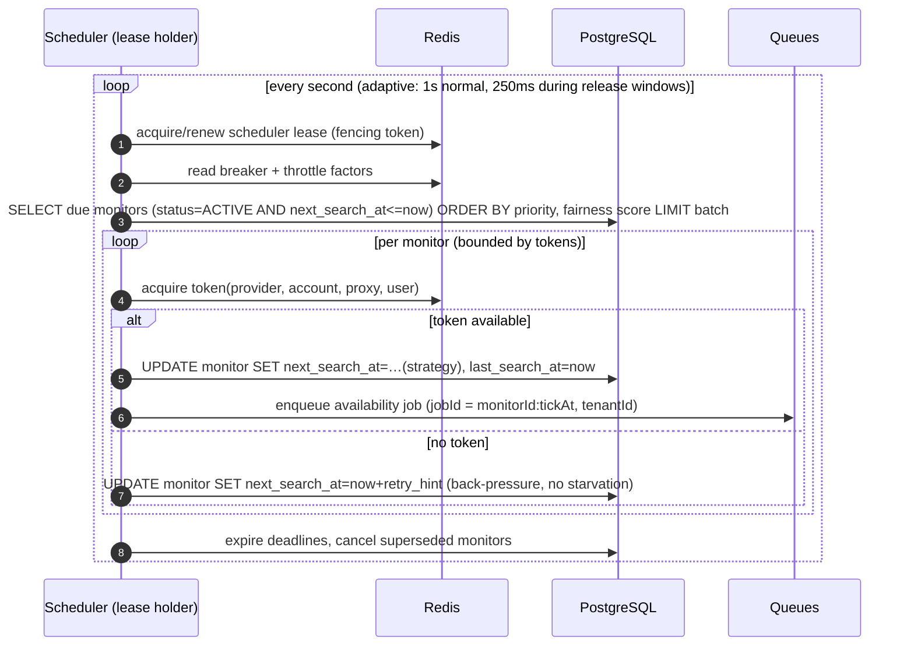

# Availability Monitoring & Scheduling

> Code: [`packages/booking/src/monitor/`](../packages/booking/src/monitor/) ·
> [`apps/scheduler/`](../apps/scheduler/) · Related: [high-demand-mode.md](high-demand-mode.md),
> [architecture.md](architecture.md) § 8

---

## 1. Monitoring strategies

A `booking_monitor` is one (leg, travel-date) pair. Each monitor has a strategy that decides its
next search time and interval. All strategies are **rate-limit aware**: they read the current
provider/account/user token state and the breaker state before scheduling.

| Strategy | Behaviour | When it is used |
| --- | --- | --- |
| `FIXED` | constant interval (`interval_seconds`) | simple plans, low-traffic routes |
| `JITTERED` | interval ± jitter (default ±25% or ±15 s) | **default**: spreads load, avoids synchronised bursts |
| `PRIORITY_BASED` | interval scaled by monitor priority (1 = fastest) | multi-date requests (Oct 10 ≻ Oct 11 ≻ Oct 12) |
| `EXPONENTIAL_BACKOFF` | interval × 2^failures, capped | after transient failures |
| `RELEASE_TIME` | dormant until `warmup_start`, burst at release, decay afterwards | presale/release windows |
| `ADAPTIVE` | reacts to observed availability rate: faster when the route showed movement recently, slower when quiet; always ≥ floor | premium plans, long-horizon monitoring |

Interval resolution (server-side, not user-controlled):

```
effective_interval = max(
    provider_min_interval,                    # system_settings / provider profile
    plan_entitlements.min_interval,           # plan floor (e.g. FREE 300s, PRO 60s)
    strategy_interval(monitor),
) * plan_speed_factor * global_load_factor
```

`global_load_factor` rises when the provider is under pressure (throttle signals, high error rate,
release-window concurrency) — the platform slows *everyone* down together rather than letting some
users hammer the provider (see § 5).

## 2. Tick loop (scheduler)



**Fairness.** Monitors are selected with a weighted fair queue: each tenant receives a share
proportional to its plan weight (FREE 1, STANDARD 2, PRO 4, PREMIUM 8, BUSINESS 8 + custom), with a
**per-tenant concurrent-search cap** and a **deficit round-robin** accumulator so a tenant with 500
monitors cannot consume the whole batch. Ties break by monitor priority, then by `next_search_at`
(oldest first). The algorithm and its guarantees are documented in § 4 and property-tested
(`fair-scheduling.spec.ts`: "no tenant is starved for more than X ticks while others are served").

## 3. Burst validation (ticket may disappear before a user acts)

```
availability observed  ─┬─► t+0s   re-validate
                        ├─► t+3s   re-validate (only if still available)
                        └─► t+10s  re-validate (only if still available)
then: return to normal cadence
```

* Only runs when the provider has spare token budget; consumes tokens like any other search.
* Maximum 3 extra requests per observation; identical observations re-use cached results.
* If validation fails at any step, we do not notify the user about a ticket we cannot confirm, and we
  record the volatility instead (`availability_observations`, used later by "waitlist intelligence").

## 4. Fair scheduling algorithm (documented)

```text
inputs:  due monitors grouped by tenant, tenant weight w_t, tenant concurrency cap c_t,
         global token budget B (per tick), priority p_m (1..5), plan speed factor
steps:
  1. compute quantum q_t = max(1, floor(B * w_t / Σ w))
  2. deficit d_t += q_t                       # carry-over from previous ticks
  3. serve up to min(d_t, c_t, |due_t|) monitors from each tenant,
     ordered by (priority asc, next_search_at asc), decrementing d_t and B
  4. leftover B is redistributed to tenants with unmet demand in weight order
  5. any tenant whose demand was throttled gets next_search_at = now + back-pressure hint
```

Properties (tested):

* **No starvation**: every due monitor is served within `ceil(total_due / B)` ticks + jitter,
  independent of other tenants' load.
* **No monopoly**: a tenant cannot exceed `min(d_t, c_t)` in a single tick regardless of weight.
* **Safety**: Σ served ≤ B (global token budget) — the provider is never exposed to more traffic
  than the budget allows.
* **Fairness under release windows**: during a release window, the budget for non-admitted tenants is
  reduced but never zero, so ordinary monitoring keeps working (degrades gracefully).

## 5. Global provider rate limiter

Token buckets (all in Redis, atomic via Lua):

| Bucket | Key | Default | Purpose |
| --- | --- | --- | --- |
| Provider | `rl:provider:{code}` | profile-driven (e.g. 30/min, burst 10) | hard ceiling for the whole platform |
| Account | `rl:account:{accountId}` | 1 concurrent, 12/min | mimics human browsing, protects the account |
| Proxy | `rl:proxy:{proxyId}` | 30/min | protects third-party egress |
| Worker | `rl:worker:{workerId}` | pool-derived | avoids single-worker hotspots |
| User | `rl:user:{userId}` | plan-derived (e.g. 10/min) | prevents a single tenant burning the budget |
| Release window | `rl:release:{windowId}` | window profile | burst allowance at presale |

Guarantees:

1. A request needs a token from **all** applicable buckets (multi-bucket acquire is atomic).
2. Denials are metrics (`ratelimit_denied_total{bucket}`) and are logged with the deciding bucket.
3. `Retry-After` from the provider triggers a **provider-wide** slow-down (halve rate, set
   `global_load_factor`), not just a per-request retry.
4. Bucket parameters are configurable via `system_settings` but bounded by hard ceilings in code —
   an operator cannot configure an unsafe rate.

## 6. Circuit breaker

States `CLOSED → OPEN → HALF_OPEN → CLOSED`.

| Transition | Condition (defaults, configurable) |
| --- | --- |
| CLOSED → OPEN | failure ratio > 40% over ≥ 20 samples **or** 3 consecutive timeouts **or** provider maintenance signal |
| OPEN → HALF_OPEN | after cooldown (60 s, exponential to 15 min) |
| HALF_OPEN → CLOSED | 3 consecutive successes |
| HALF_OPEN → OPEN | any failure |

While OPEN: searches stop, jobs stay queued, users see honest status ("provider unavailable"),
admins are alerted, and cached station/route data keeps the UI useful. Breaker state is persisted
(`circuit_breaker_states`) for visibility and audit.

## 7. Provider & account health scores

```
provider_health = 100
  - 30 * error_rate(15m)          # search/login/parse failures
  - 20 * timeout_rate(15m)
  - 15 * schema_drift_events(1h)
  - 10 * throttle_events(15m)
  +  5 * availability_rate(1h)    # capped contribution
clamped to [0, 100]

account_health = 100
  - 35 * login_failure_rate(1h)
  - 25 * session_invalidations(1h)
  - 20 * restriction_signals(24h)     # explicit provider restriction messages only
  - 20 * booking_failure_rate(1h)
clamped to [0, 100]
```

* Health is **descriptive, not punitive**: it drives scheduling prudence (lower health ⇒ lower
  concurrency) and admin visibility. It never triggers automatic account switching to evade a
  restriction (TM-12); restrictions quarantine the account and alert a human.
* Proxy health uses the same shape (latency, success rate, last success/failure) with automatic
  temporary quarantine on repeated failures (`quarantined_until`).

## 8. Deadlines and priority decay

* Every high-demand job may carry a `deadline_at` (release window end, or user-specified).
* Expired jobs are removed from priority queues by the scheduler's sweep (`job_deadlines`), moved to
  `EXPIRED`, and the user is notified — no zombie jobs consume tokens.
* Priority decays by one level per `priority_decay_minutes` while a monitor keeps failing, so a
  broken monitor cannot outrank healthy work forever.

## 9. Metrics

`monitor_due_total`, `search_dispatched_total{provider,priority}`, `search_outcome_total{class}`,
`search_latency_seconds`, `ratelimit_denied_total{bucket}`, `breaker_state{provider}`,
`queue_depth{queue}`, `queue_oldest_job_age_seconds{queue}`, `scheduler_tick_duration_seconds`,
`fairness_deficit{tenant_class}`, `provider_health_score{provider}`, `account_health_score`,
`proxy_health_score`, `capacity_admissions_total{window,result}`.
